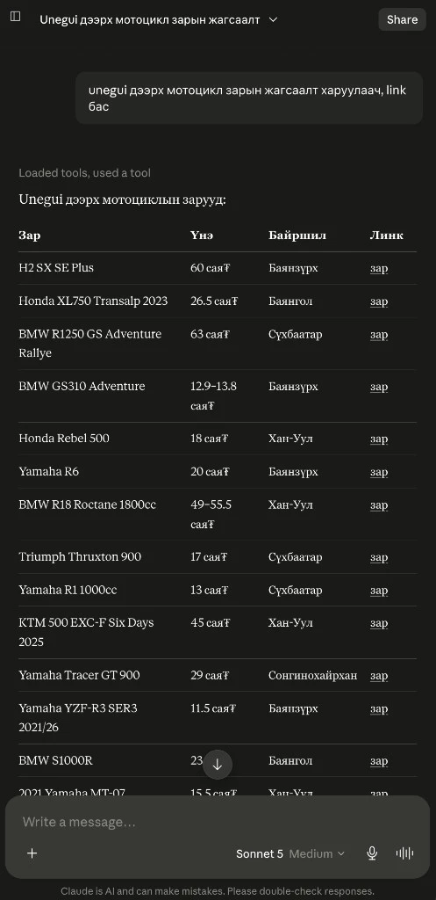

# Unegui.mn MCP Server

[Монгол](README.md) | **English**

> MCP server for [unegui.mn](https://www.unegui.mn) — Mongolia's largest online classifieds marketplace.

Search, browse, and retrieve detailed listings for vehicles, real estate, electronics, jobs, and more — directly from your AI assistant. **Mongolian is the default language**; English queries are also supported.

## Documentation

| | |
|---|---|
| [Features](docs/en/features.md) | MCP tools and supported categories |
| [Quick start](docs/en/quick-start.md) | Install and run |
| [MCP configuration](docs/en/mcp-configuration.md) | Cursor, VS Code, Claude Desktop |
| [Usage examples](docs/en/usage-examples.md) | Example prompts for your AI assistant |
| [How it works](docs/en/how-it-works.md) | Technical overview |
| [Project structure](docs/en/project-structure.md) | File layout |
| [Development](docs/en/development.md) | Tests and contributing |
| [Disclaimer](docs/en/disclaimer.md) | Responsibility and limitations |

## License

[MIT](LICENSE) © [Enkhbold Ganbold](https://github.com/enkhbold470)

**Author:** [Enkhbold Ganbold](https://github.com/enkhbold470)
