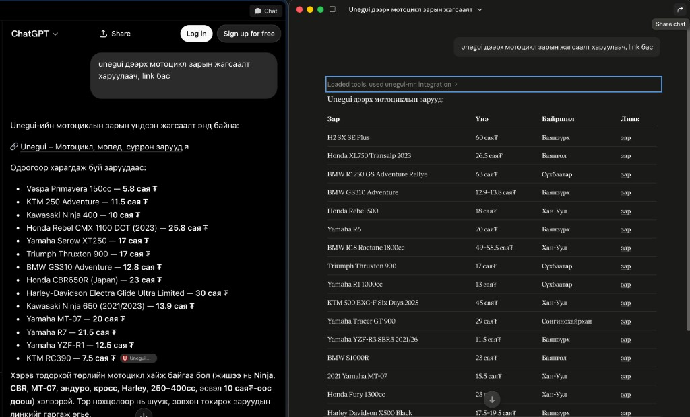

# Unegui.mn MCP Server

[Монгол](../../README.md) | **English**

[](../../LICENSE)
[](https://www.npmjs.com/package/unegui.mn-mcp)
[](https://www.npmjs.com/package/unegui.mn-mcp)
[](https://www.python.org/downloads/)
[](https://modelcontextprotocol.io)
[](#development)

> MCP server for [unegui.mn](https://www.unegui.mn) — Mongolia's largest online classifieds marketplace.

Search, browse, and retrieve detailed listings for **vehicles, real estate, electronics, jobs, services, and more** — directly from your AI assistant. **Mongolian is the default language**; English queries are also fully supported.



## Features

| Tool | Description |
|---|---|
| 🔍 `search_listings` | Keyword search across all listings (e.g. "Toyota", "2 bedroom") |
| 📂 `browse_category` | Browse listings by category (vehicles, real estate, etc.) |
| 📋 `get_listing_details` | Get full details for a specific listing URL |
| 🗂️ `list_categories` | List all available categories and subcategories |
| 🆕 `get_recent_listings` | Get the latest listings from the homepage |

## Install

Requires [Node.js 18+](https://nodejs.org) and [uv](https://astral.sh/uv).

```bash
npx -y unegui.mn-mcp install
```

Auto-configures Claude Desktop and Cursor. Restart the app afterward.

## Run

```bash
npx -y unegui.mn-mcp
```

## MCP config (manual)

```json
{
  "mcpServers": {
    "unegui-mcp": {
      "command": "npx",
      "args": ["-y", "unegui.mn-mcp"]
    }
  }
}
```

> npm package: [unegui.mn-mcp](https://www.npmjs.com/package/unegui.mn-mcp)

## Example Prompts

Once MCP is active in Claude Desktop or Cursor, you can ask:

- *"Find Toyota Land Cruiser 300 listings for sale"*
- *"Are there 2-bedroom apartments for sale in Ulaanbaatar?"*
- *"Show me the 10 most recent listings"*
- *"Search for iPhone in the electronics category"*

## Documentation

| | |
|---|---|
| [Features](features.md) | MCP tools and supported categories |
| [Quick start](quick-start.md) | Install and run |
| [MCP configuration](mcp-configuration.md) | Cursor, VS Code, Claude Desktop |
| [Usage examples](usage-examples.md) | Example prompts for your AI assistant |
| [How it works](how-it-works.md) | Technical overview |
| [Project structure](project-structure.md) | File layout |
| [Development](development.md) | Tests and contributing |
| [Disclaimer](disclaimer.md) | Responsibility and limitations |

## Project

| | |
|---|---|
| [Contributing](../CONTRIBUTING.md) | How to contribute |
| [Changelog](../CHANGELOG.md) | Release history |
| [Security](../SECURITY.md) | Report vulnerabilities |
| [Code of conduct](../CODE_OF_CONDUCT.md) | Community standards |

## License

[MIT](../../LICENSE) © [Enkhbold Ganbold](https://github.com/enkhbold470)

**Author:** [Enkhbold Ganbold](https://github.com/enkhbold470)
